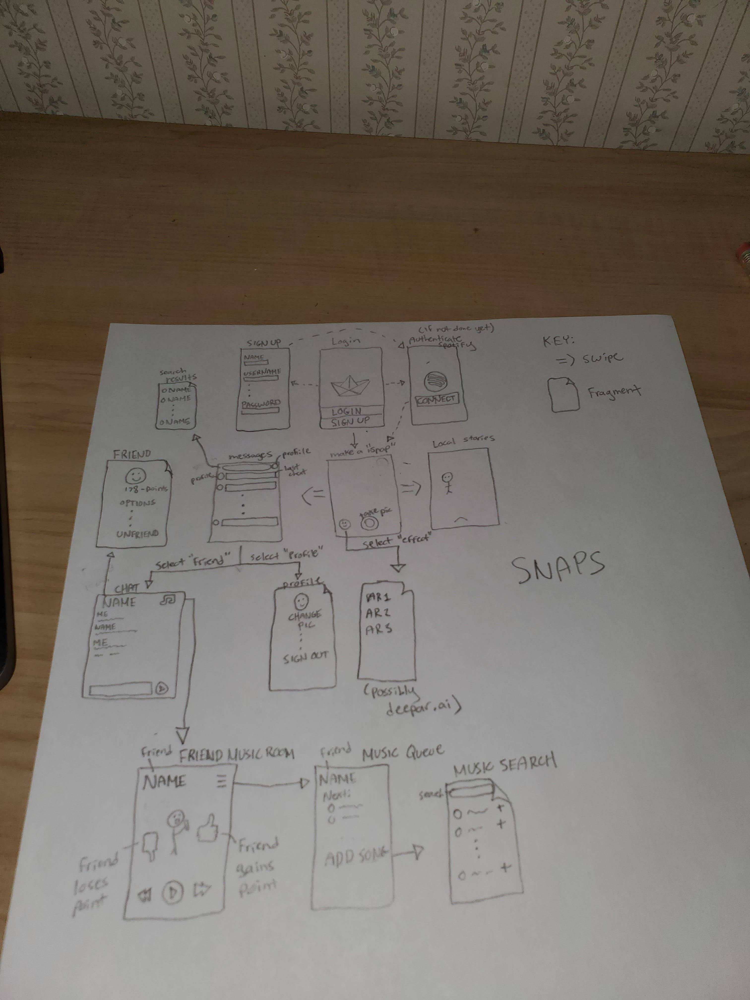

# PIX

## Table of Contents
1. [Overview](#Overview)
1. [Product Spec](#Product-Spec)
1. [Wireframes](#Wireframes)
2. [Schema](#Schema)

## Overview
### Description
Client to authenticate with both Parse Server and Spotify API so that users can message each other but also listen to music together.

### App Evaluation
[Evaluation of your app across the following attributes]
- **Category:** Social/Entertainment
- **Mobile:** Cannot message on Spotify nor play music on messenger alone.
- **Story:** Allows users to listen to music together.
- **Market:** People who want to use an interactive version of Spotify.
- **Habit:** Just like a messenger, you need to open the app to view messages.
- **Scope:** I stripped down version is still interesting, would use a DB like Parse server to link users to songs. Definitely do-able in 4 weeks.

## Product Spec

### 1. User Stories (Required and Optional)

**Required Must-have Stories**

* User can login to Parse and Spotify
* User can select a friend
* User can chat with selected friend
* User can enter "music room" with friend
    * Can set a song
    * Song plays for both users if both in room

**Optional Nice-to-have Stories**

* Song play is synchronized
    * A pause pauses all users
* Messaging IU is Snapchat themed
* Can save messages
* Can somehow "like" a song
* Song plays when app is in background
* Can add songs to a queue
* Can search people on our DB to add as friends

### 2. Screen Archetypes

* Login screen
   * User authenticates with
       * Parse Server
       * Spotify
* Chats overview
   * List of chats with friends from which the User can select one
* Chat
    * User can chat with a friend
    * Can enter Music room for this friend
* Music room
    * User can set the current song
    * Friend would also see this song playing

### 3. Navigation

**Tab Navigation** (Tab to Screen)

* Friends List
* Search user (Potentially)

**Flow Navigation** (Screen to Screen)

* Login screen
    *  => Chats overview
* Chats overview
    *  => Chat
* Chat
    *  => Chat overview
    *  => Music room
* Music room
    *  => Chat

## Wireframes
[Add picture of your hand sketched wireframes in this section]

### [BONUS] Digital Wireframes & Mockups

### [BONUS] Interactive Prototype

## Schema 
### Models
#### User

   | Property      | Type     | Description |
   | ------------- | -------- | ------------|
   | objectId      | String   | unique id |
   | username        | String| name |
   | password         | String     | security |
   | image       | File   | profile picture |
   | likes | Number   | Number of likes user has recieved |
   | createdAt     | DateTime | date when post is created (default field) |
   | updatedAt     | DateTime | date when post is last updated (default field) |
   
   #### Friendship

   | Property      | Type     | Description |
   | ------------- | -------- | ------------|
   | objectId      | String   | unique id |
   | user1        | Pointer to User | first of 2 friends |
   | user2        | Pointer to User | second of 2 friends |
   | createdAt     | DateTime | date when post is created (default field) |
   | updatedAt     | DateTime | date when post is last updated (default field) |
   
   #### Message

   | Property      | Type     | Description |
   | ------------- | -------- | ------------|
   | objectId      | String   | unique id |
   | sender        | Pointer to User | User who sent the message |
   | recipient        | Pointer to User | User who got the message |
   | messageText | String | Message body |
   | messageImage | File | Message picture |
   | createdAt     | DateTime | date when post is created (default field) |
   | updatedAt     | DateTime | date when post is last updated (default field) |
   
   #### Song

   | Property      | Type     | Description |
   | ------------- | -------- | ------------|
   | objectId      | String   | unique id |
   | location        | String | where to get the song |
   | title        | String | title of Song |
   | artist | String | artist of Song |
   | album | String | name of album |
   | albumCover | File | image of album |
   | createdAt     | DateTime | date when post is created (default field) |
   | updatedAt     | DateTime | date when post is last updated (default field) |
   
   #### MusicRoom

   | Property      | Type     | Description |
   | ------------- | -------- | ------------|
   | objectId      | String   | unique id |
   | currentSong        | Pointer to Song | currently playing song |
   | nextSong        | Pointer to Song | next song |
   | friendship | Pointer to Friendship | two people that are in this room |
   | timeLastStart | DateTime | time last song started |
   | createdAt     | DateTime | date when post is created (default field) |
   | updatedAt     | DateTime | date when post is last updated (default field) |
   
   
### Networking
* Login Screen
   * (Create/POST) Sign up a user
   * (Read/GET) Authenticate user and get the Token back
         
                ParseUser.logInInBackground(etUsername.getText().toString(), etPassword.getText().toString(), new LogInCallback() {
                    @Override
                    public void done(ParseUser user, ParseException e) {
                        if (e != null) {
                            Toast.makeText(LoginActivity.this, "Wrong Username/ Password", Toast.LENGTH_SHORT).show();
                            return;
                        }
                        goToMain();
                    }
                });

* Compose Screen
   * (Create/POST) Create a new message with an image

* Messages Screen
   * (Create/POST) Add a new friend through lookup fragment
   * (Read/GET) Get all messages

* Chat Screen
   * (Create/POST) Create a new message
   * (Read/GET) Get all messages
   * (Delete) Delete existing message
   * (Delete) Delete existing friendship through friend profile fragment

* User's Profile Screen
   * (Create/POST) Change profile pic
   * (Read/GET) Get user data
   * (Delete) Sign User out(Invalidate Authentication Token)

* Music Room Screen
   * (Create/POST) Add a song to music queue
   * (Read/GET) Get current and next song
   * (Delete) Change the current or next song
